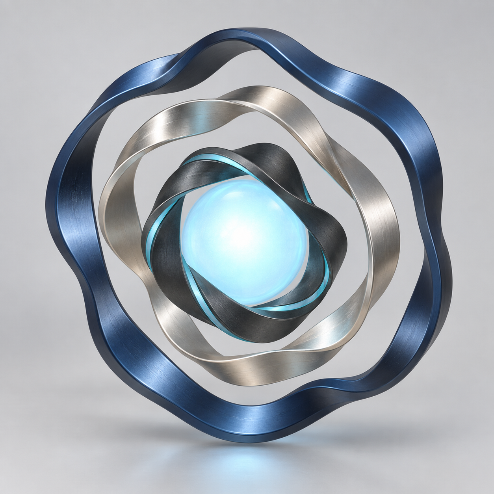
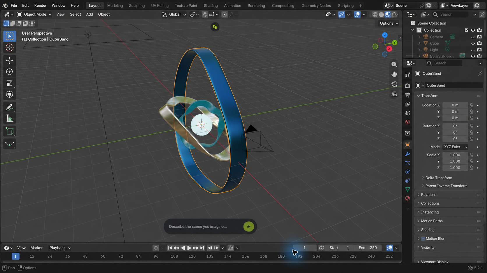
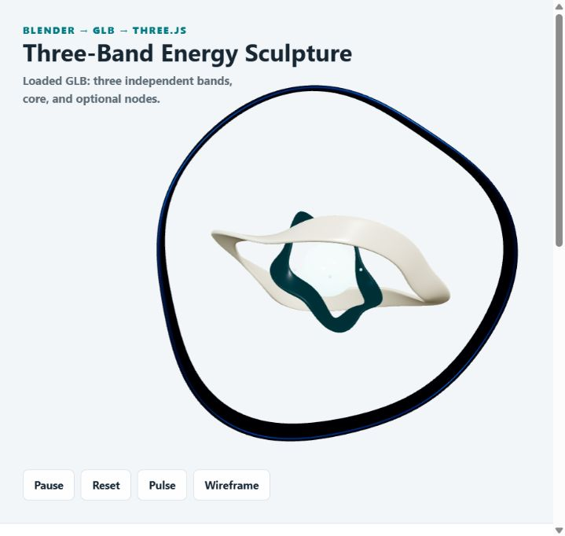

# Three-Band Energy Sculpture

An end-to-end Blender-to-web experiment: a generated concept image is translated into deterministic Blender geometry, exported as GLB, and animated in a browser with Three.js.

## Visual Transformation

### 1. Original Astra Concept

The generated reference image established the sculpture's nested-band composition, metallic palette, and luminous core.



### 2. Blender 3D Asset

Blender Python converted the visual direction and mathematical specification into editable, separately named 3D geometry.



### 3. Final Interactive Website

Three.js loads the exported GLB and gives each band an independent pointer-responsive spring motion.



## Live Pages

- [Project index](https://az9713.github.io/blender-to-web-demo/)
- [Interactive sculpture](https://az9713.github.io/blender-to-web-demo/public/)
- [Code and data pipeline](https://az9713.github.io/blender-to-web-demo/CODE-AND-DATA-PIPELINE.html)
- [Project handoff](https://az9713.github.io/blender-to-web-demo/docs/blender-to-web-project-handoff.html)

## Source Inspiration

The workflow was inspired by this [YouTube demonstration](https://www.youtube.com/watch?v=RhGiG-yZP-c&t=15s), which presents a design-to-Blender-to-web production process. This repository independently implements that general workflow with an original mathematical sculpture, original Blender Python, and original Three.js interaction code. It does not copy the video's sculpture or source code.

## Pipeline

1. A concept image establishes the visual target.
2. `scripts/create_asset.py` uses Blender's `bpy` and `mathutils` APIs to generate three closed bands and a luminous core.
3. Blender saves the editable `.blend`, exports a browser-ready `.glb`, and renders verification images.
4. `public/src/main.js` loads the GLB with Three.js `GLTFLoader`, assigns each band to its own runtime pivot, and applies pointer, scroll, pulse, pause, reset, and wireframe interactions.
5. GitHub Actions deploys the complete static repository to GitHub Pages.

## Tech Stack

- Blender 5.2.1 LTS
- Blender Python: `bpy`, `mathutils`
- glTF 2.0 / GLB
- Three.js r186 and `GLTFLoader`
- Plain HTML, CSS, and JavaScript
- Node.js local static server
- GitHub Pages and GitHub Actions

## Run Locally

```powershell
node server.cjs
```

Open `http://127.0.0.1:4186/`.

## Rebuild the Blender Asset

```powershell
$BlenderExe = '<path-to-blender.exe>'
& $BlenderExe --background --python-exit-code 1 --python .\scripts\create_asset.py
```

This regenerates the editable Blender file, exported GLB, fallback image, geometry report, and Blender preview renders.

## Project Map

- `astra-three-band-concept.png`: original generated concept image retained at repository root
- `scripts/create_asset.py`: concept-to-Blender procedural modeling and GLB export
- `assets/energy-sculpture.blend`: editable Blender source
- `public/models/energy-sculpture.glb`: browser-ready 3D asset
- `public/src/main.js`: Three.js loading, interaction, and animation
- `CODE-AND-DATA-PIPELINE.html`: code-level data conversion guide
- `DEVELOPMENT-JOURNEY.md`: step-by-step build record
- `docs/blender-to-web-project-handoff.html`: complete project specification and handoff
- `evidence/`: geometry, environment, browser, and screenshot verification

The vendored Three.js license is preserved at `public/vendor/three/LICENSE`.
